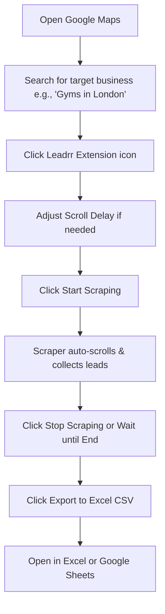

# Leadrr — Google Maps Lead Generator & Business Scraper

Leadrr is a high-performance, automated Chrome Extension designed to extract high-quality business leads directly from Google Maps search results. Whether you are a B2B sales representative, marketing professional, or agency owner, Leadrr simplifies your cold outreach campaigns by scraping vital business details with a single click and exporting them into structured Excel-ready CSV files.

---

 🚀 Key Features

- ⚡ Automated Infinite Scrolling: Automatically scrolls through the Google Maps results panel to load and scrape every listing without manual intervention.
- 🔍 Deep Attribute Extraction: Extracts all key business parameters:
  - Business Name
  - Star Rating
  - Total Reviews Count
  - Industry Category
  - Verified Phone Number
  - Physical Address
  - Direct Google Maps URL
- ⏱️ Dynamic Scroll Delay: Custom slider to configure the scroll delay (1.0s to 6.0s) to prevent Google Maps rate limits or temporary blockages.
- 📊 Real-time Live Preview: View a live, scrollable feed of incoming leads directly inside the clean extension popup.
- 💾 Auto-Save State: Restores your scraping progress, lists, and slider settings even if you close the extension popup.
- 📥 Instant Export: Single-click export to CSV with UTF-8 BOM compatibility, ensuring all special and international characters render flawlessly in Microsoft Excel.

---

 🛠️ Installation Guide

Follow these steps to load Leadrr into your Google Chrome browser:

1. Download/Clone the Repository:
   Download the repository zip file and extract it to your preferred local directory (e.g., `C:\chrome extensions\leadrr`).

2. Open Extensions Manager:
   Open Google Chrome, type `chrome://extensions/` in the URL bar, and press Enter.

3. Enable Developer Mode:
   Toggle the Developer mode switch in the top-right corner of the Extensions page.

4. Load Unpacked Extension:
   Click the Load unpacked button in the top-left corner, navigate to the extracted `leadrr` directory, select it, and click Open.

5. Pin Leadrr:
   Click on the Extensions puzzle icon next to the browser search bar and pin Leadrr for quick access.

---

 📖 How to Use

1. Go to [Google Maps](https://www.google.com/maps).
2. Search for any business type in your target location (e.g., *“Real Estate Agents in Miami”* or *“Cafes in Paris”*).
3. Click the Leadrr icon in the toolbar.
4. Set your preferred Scroll Delay (default: `2.5s` is recommended for standard connections).
5. Click Start Scraping. The scraper will automatically find the scroll container and begin scrolling and scraping leads.
6. The counts and live preview will update in real-time.
7. Click Stop at any point or let it run until the end of the results.
8. Click Export to Excel (CSV) to download your business spreadsheet.

 ⚙️ Architecture & Technical Stack

Leadrr is built strictly using standard web technologies and the latest extension standards:

- Manifest V3: Ensures maximum security, performance, and long-term compatibility with future Chrome updates.
- Vanilla CSS3: Sleek, modern dark-themed dashboard UI utilizing glassmorphic aesthetics, fluid micro-animations, and vibrant accents.
- Chrome Storage API: Utilizes `chrome.storage.local` to sync state asynchronously between the dashboard popup and the active Google Maps content script.
- Intelligent DOM Parser: Robust selectors that locate the Google Maps results panel and extract details accurately even as Google updates its markup.

---

This extension is built targeting the following search terms and keywords for developers, marketers, and lead generation professionals:
*Google Maps Scraper, Google Maps Lead Generator, Google Maps Business Crawler, Export Google Maps to Excel, B2B Lead Generation Tool, Chrome Extension Lead Scraper, Local Business Extractor, Map Business Scraper, Address and Phone Number Scraper, Free B2B Leads Generator.*

